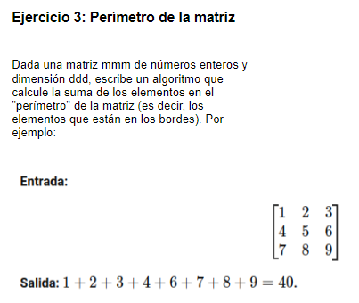

# 1. Formulación del problema

<p align="center">
  
</p>

# 2. Resolución

> I) Entrada del valor de la variable "dimension"

```bash
    public static void main(String[] args) {
        Scanner sc = new Scanner(System.in);
        System.out.println("Ingresar dimension [d]: ");
        int d = sc.nextInt();
        
        if(d <= 0){
           d = sc.nextInt();;
        }
```
> II) Inicialización de la variable almacenadora de sumatoria e ingreso de numeros en la matriz

```bash
int Suma_perimetro = Sumatoria(d);
```

```bash
    public static int Sumatoria(int d){
    Scanner sc = new Scanner(System.in);      
    int[][]Matriz = new int[d][d];
    int salida = 0;
    
    for(int i=0; i < d; i++){
        for(int j=0; j < d;j++){
            System.out.print("["+i+"]"+"[" + j+"]");
            Matriz[i][j] = sc.nextInt();           
        }
    } 
```

> III) Calculo de la sumatoria del perimetro de una matriz cuadrada dXd e impresión de la variable "Suma_perimetro"

```bash
    for(int i=0; i < d; i++){
        if(i == 0 || i == d-1){
        for(int j=0; j < d; j++){
        salida += Matriz[i][j];    
        }
        }
        else{
        salida += Matriz[i][0];
        salida += Matriz[i][d-1];
        }
    }
    
    return salida;
    }
```

```bash
    System.out.println("SUMATORIA TOTAL: " + Suma_perimetro);
```

### Codigo completo

```bash
import java.util.Scanner;

public class Main {
    
    public static int Sumatoria(int d){
    Scanner sc = new Scanner(System.in);      
    int[][]Matriz = new int[d][d];
    int salida = 0;
    
    for(int i=0; i < d; i++){
        for(int j=0; j < d;j++){
            System.out.print("["+i+"]"+"[" + j+"]");
            Matriz[i][j] = sc.nextInt();           
        }
    }    
    
    for(int i=0; i < d; i++){
        if(i == 0 || i == d-1){
        for(int j=0; j < d; j++){
        salida += Matriz[i][j];    
        }
        }
        else{
        salida += Matriz[i][0];
        salida += Matriz[i][d-1];
        }
    }
    
    return salida;
    }
   
    public static void main(String[] args) {
        Scanner sc = new Scanner(System.in);
        System.out.println("Ingresar dimension [d]: ");
        int d = sc.nextInt();
        
        if(d <= 0){
           d = sc.nextInt();;
        }

        int Suma_perimetro = Sumatoria(d);
        System.out.println("SUMATORIA TOTAL: " + Suma_perimetro);
    }
    
}
```
